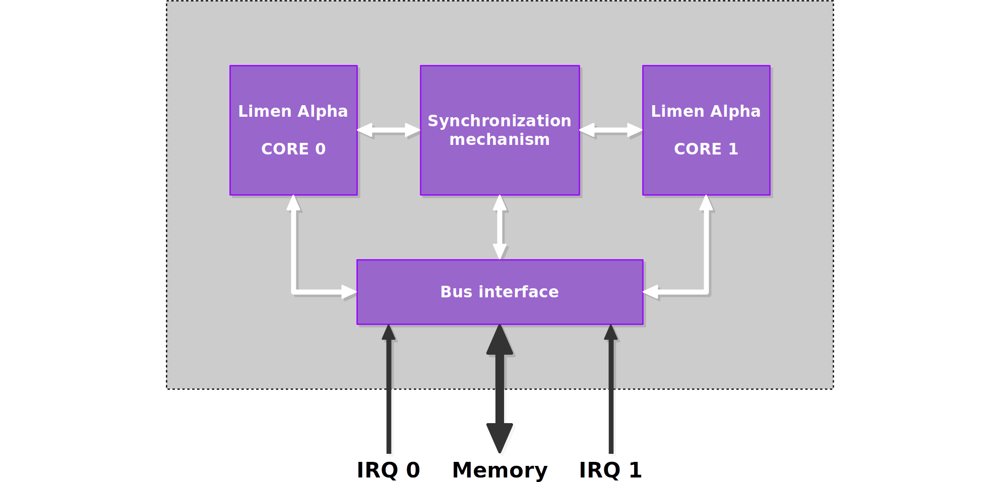

# Limen Alpha

> Dual-core 16-bit RISC processor.

Limen Alpha is a dual-core 16-bit RISC processor architecture with hardware synchronization between the cores, created in 2016. The [original code](https://github.com/dominiksalvet/limen) was established one year sooner, and then successfully used as a part of [my high school thesis](https://github.com/dominiksalvet/high-school-thesis). However, the processor has evolved since then. It has been redesigned, and now it is dual-core. Also, it supports hardware interrupts for both cores.

The work on the processor itself is now finished. However, the used coding conventions may be outdated comparing to my current standards.

## Machine Code

If you are curious how the machine code of Limen Alpha looks like, browse the [collection of such programs](sw).

## Useful Resources

* [support.md](support.md) – questions, answers, help
* [contributing.md](contributing.md) – how to get involve
* [license](license) – author and license
